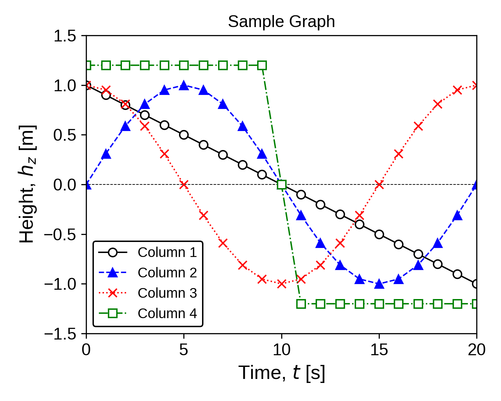

# Python_graph_plotting
Example code and utilities for scientific plotting with Python and matplotlib

## Overview
This repository provides example Python scripts for reading numerical data from text file
and generating scientific graph using matplotlib.

<!--   -->
<p>
  
</p>

## Requirements
- Python 3.x
  - NumPy
  - matplotlib

## Directory Structure
```
Python_graph_plotting/
  plot_graph.py
  data/
    1D_data.txt
  LICENSE
  README.md
```

## Input Data Format

The input text file should contain whitespace-separated numerical data.
Each column represents a different variable.

Example:
```
t[s] h1[m]    h2[m]    h3[m]    h4[m]
```
```
 0	 1.0	 0.0000	 1.000e+00	 1.2
 1	 0.9	 0.3090	 9.511e-01	 1.2
 2	 0.8	 0.5878	 8.090e-01	 1.2
...
```

## Usage

Run the script from the repository root:
```
python plot_graph.py
```
By default:
- Input file: ./data/1D_data.txt
- Character encoding: utf-8
- Output file: ./1D_data.png
- These parameters can be modified directly in the script:

```
inputfile = "./data/1D_data.txt"
Encoding  = "utf-8"
outputfile = "./1D_data.png"
```

Output
The generated figure is saved as a PNG file:
- File name: 1D_data.png
- Location: repository root (default)

## License
This project is licensed under the MIT License.